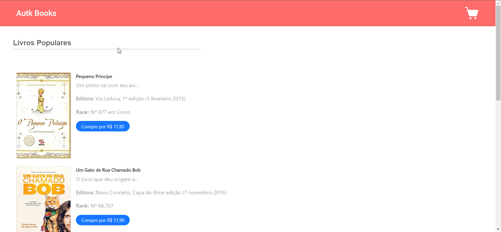

## :books: Autk Books

#### Autk Books é um projeto desenvolvido para um case de Front-End

Aqui disponibilizamos livros para que você possa adicionar ao carrinho de compras e tenha desconto, caso esteja dentro da regra de desconto. A loja tem uma promoção especial para quem compra por esses novos meios, que consiste em dar descontos ao total da compra, dependendo da quantidade de livros distintos que estão sendo comprados.

A regra de descontos é a seguinte:

- 2 livros distintos: 5%
- 3 livros distintos: 10%
- 4 livros distintos: 20%
- 5 ou mais livros distintos: 25%

---


### Demo:



---

[Meu quadro no Trello](https://trello.com/invite/b/y9mWexLR/ATTI3266832246f003699f3d6a9fff2ea4deE2604EFF/case-autkbooks)

****

### 💻 Tecnologias Utilizadas:

- [x] React
- [x] React router
- [x] Webpack
- [x] Antd
- [x] Styled Components
- [x] Axios
- [x] YARN
- [x] JSON Server
- [x] Git
- [x] GitLab

---

### 🏚️ Rodar o projeto _front-end e back-end_ localmente

#### ⚠️ Pré-requisitos:

Node.js e YARN/NPM instalado

#### Passo 1: Clone o projeto na sua máquina

```sh
git clone git@gitlab.com:ariane011/autk-books.git
```

#### Passo 2: Acesse a pasta do back-end

```sh
cd autk-books/back-end
```

#### Passo 3: Instale todas as dependências do projeto

```sh
npm install
```

#### Passo 4: Rode o projeto back-end na sua máquina

```sh
npm start
```

#### Passo 5: Agora, acesse o projeto principal e instale todas as dependências

```sh
yarn install
```

#### Passo 6: Rode o projeto 

```sh
yarn start
```

#### Passo 7: Abra o navegador e visualize o projeto

```sh
http://localhost:3000
```
